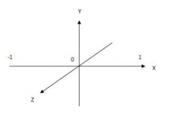

## 如何利用OpenGL渲染V4L2输入的YUY2格式视频

@(opengl)

[TOC]
### 1. 背景知识
#### 1.1 渲染需要准备什么？


从上图可以看到GL2.0的流程以及组件定义，我们通过OpenGL的API，需要
1. 设置顶点数组或buffer对象
2. 设置顶点着色器(Vertex Shader)
3. 设置纹理
4. 设置片元着色器(Fragment Shader)

`P.S.:`


`3.0 比2.0 多了 Transform Feedback, 有兴趣的同学可以自行学习，这里我们使用的是OpengGL2.0`
##### 1.1.1 什么是顶点着色器？


**输入:**
`Attribute:`顶点数组提供的每个顶点数据，可通过API设置
`Uniforms:`顶点着色器使用的常量，可通过API设置
`Samplers:`可选项，顶点着色器使用的纹理（`我没用到`），可通过API设置
`Shader program:`使用着色器语言编写的程序
**输出:**
`Varying:`可变变量（`顶点着色器向片元着色器传递的变量`）
`gl_Postion:`内置变量，高精度浮点数，用来表示当前顶点坐标（`可以利用他做坐标变化`）
`gl_FrontFacing:`内置变量，布尔类型，不能主动设置，用来判断当前点是否面向观察者(`3.0里不在这里输出`)
`gl_PointSize:`内置变量，中等精度浮点数，设置点精灵大小
> 结合图1-1，顶点着色器其实就是根据用户编写的`顶点着色器语言`设定顶点坐标变换规则，通过原始数据加载和光栅化后传递给`片元着色器`

##### 1.1.2 什么是片元着色器？
千呼万唤始出来，前边都在说这个，这个到底是什么呢？


**输入:**
`Varying:`可变量，从`顶点着色器`传递过来的
`Uniforms:`参考顶点着色器
`Samplers:`可选项，片元着色器使用的原始数据纹理
`gl_FragCoord:`只读，标识窗口坐标(x,y,z,1/w)
`gl_FrontFacing:`参考顶点着色器
`gl_PointCoord:`只读，渲染点精灵大小
**输出:**
`gl_FragColor:`输出到每个片元的颜色，vec4（`rgba`），可以通过设置glColorMask，关闭颜色输出
> 片元着色器可以理解为决定最终交给framebuffer什么样的数据，让GPU进行显示

##### 1.1.3 几个坐标系
*理解后可以用作镜像等处理*
1. 2D纹理坐标


2. OpenGL顶点坐标系



3. 设备屏幕坐标系


`由于android设备屏幕坐标是左上角为0，设置的时候注意图像颠倒`
> `Tips:以上三者结合，能做到对纹理进行最基本剪裁/翻转/形变操作`

**举个栗子:**
`以下例子仅适用于未在顶点着色器中，对坐标进行特殊矩阵变换的case`
顶点全屏坐标
>`小知识点：`
>`绘制时采用GL_TRIANGLE_STRIP，其规则为第i个顶点，若为奇数，绘制三角形的取点顺序为(i-1,i-2,i);若为偶数，绘制三角形的取点顺序为(i-2,i-1,i)`

按照以上规则绘制出矩形即可，三角形绘制顺序随便，关键是纹理坐标配合顶点坐标进行相关设置
```
vertex{
	-1.,1.,  //v0
	1.,-1.,  //v1
	-1.,1.,  //v2 
	1.,1.    //v3
}
```
正常纹理
（与顶点坐标一一对应）
```
tex_coor{
     0.,1., 
     1.,1.,
     0.,0.,
     1.,0.
}
```
水平镜像
```java
tex_coor{
     1.,1., 
     0.,1.,
     1.,0.,
     0.,0.
}
```
`提问:垂直镜像如何编写纹理坐标？`
##### 1.1.4 基本思路
> 将从V4L2中获取的每帧数据作为纹理交给片元着色器进行渲染
> `需要:`
> 1. 顶点着色器程序
> 2. 片元着色器程序
> 3. 每帧raw数据
##### 1.1.5 问题
然而没有想的那么简单
>1. 一般Camra输入都为YUV的数据格式，而片元着色器输出需要rgba的数据格式
>2. 提到YUV格式，简单介绍下，别懵逼了:
>2.1. Y --- 亮度分量  U,V --- 色度分量
>2.2. 按照分量存储的连续性分为`planar`（YUV分别连续存储),`semi-planar`(Y分量连续,UV分量交叉存储)和`packed`（YUV分量交叉存储）
>2.3. 按照采样规则又分为`444`(每个Y对应一组UV),`422`(每两个Y共用一组UV)和`420`(每四个Y共用一组UV)
>2.3. 安卓默认相机里出来的raw数据格式为`NV21`(属于YUV420semi-planar，YYYYVU)或`YV12`(属于YUV420planar，YYYYVU)
>2.4. **而我们的V4L2里获取的数据是`YUY2`中的`YUYV`(属于YUV422packed，YUYV)`每四个字节表示两个像素点`，提问，`分辨率为WxH的图片，这个格式的字节数组有多长？`(这个问题的答案能帮助解决后续纹理颜色格式设置问题)**
>3. 使用glTexImage2D设置纹理的时候，只支持以下颜色格式输入
>

>4. 若颜色转换的所有计算都让GPU来做，`需要研究如何在片元着色器中将YUV格式转换为RGB`
> `简单解释下在录入纹理和片元读取纹理的时候会发生什么`

| 颜色格式  |   录入描述|片元处理描述 | 
| --- | --- | --- | --- | --- | --- |
|GL_RGB |每个位置读取3个指定格式单位，分别表示RGB | 获取Sampler上对应位置数据时，拿到的即为R,G,B,1.0|
|GL_RGBA |每个位置读取4个指定格式单位，分别表示RGB | 获取Sampler上对应位置数据时，拿到的即为R,G,B,A|
|GL_LUMINACE |每个位置读取1个指定格式单位，表示为LLL1.0 | 获取Sampler上对应位置数据时，拿到的即为LLL1.0（`前三个值相等`）|
|GL_LUMINACE_ALPHA |每个位置读取2个指定格式单位，表示为LLLA （`第一个表示为L,第二个表示为A`）| 获取Sampler上对应位置数据时，拿到的即为LLLA（`前三个值相等`）|
|GL_ALPHA|每个位置读取1个指定格式单位，表示为000A | 获取Sampler上对应位置数据时，拿到的即为000A|

##### 1.1.6 思考
>1. 使用glTexImage2D时，以什么格式将每帧数据作为纹理设置给片元着色器？
>2. 片元着色器如何处理每个点的像素颜色转换？`这里需要学习一下GLSL的基本语法规则`
>`p.s.:若图片源颜色格式为planar或semi-planar类，如何设置纹理？`
### 2. 实际操作
#### 2.1 初始化GLSurfaceView
```java
        glSurfaceView.setEGLContextClientVersion(2);//由于我们要使用2.0的部分特性，务必显式设置当前EGL版本
        glSurfaceView.setRenderer(new CameraGLSurfaceRenderer());//设置我们的render
        glSurfaceView.setRenderMode(GLSurfaceView.RENDERMODE_WHEN_DIRTY);//设置render模式
```
#### 2.2 顶点坐标和纹理坐标
```java
        private static float[] squareVertices = {
                -1.0f, -1.0f, 1.0f, -1.0f,
                -1.0f, 1.0f, 1.0f, 1.0f,}; // fullscreen

        //此处水平镜像
        private static float[] coordVertices = {
                1.0f, 1.0f, 0.0f, 1.0f,
                1.0f, 0.0f, 0.0f, 0.0f,};// whole-texture
```
#### 2.3 顶点着色器
```java
        private static final String VERTEX_SHADER =
                "attribute vec4 aPosition;\n" +
                        "attribute vec2 aTextureCoord;\n" +
                        "varying vec2 vTextureCoord;\n" +
                        "uniform mat4 uMVPMatrix;" +
                        "void main() {\n" +
                        "  gl_Position = uMVPMatrix * aPosition;\n" +
                        "  vTextureCoord = aTextureCoord;\n" +
                        "}\n";
```
为了方便进行矩阵投影(视锥体)变换，添加uMVPMatrix(视点矩阵*投影矩阵)，顶点着色器没有太多可以讲的。
简言之即为，将顶点坐标/纹理坐标/投影变换矩阵通过OpenGL API设置给顶点着色器，顶点着色器输出顶点位置坐标和纹理坐标给片元处理器进行纹理处理。
#### 2.4 片元着色器
`重头戏来了，前边遇到的所有问题都需要在这里解决`
##### 2.4.1  创建纹理
1. 分辨率为WxH的YUY2颜色格式的图片，其字节数组长度为WxHx2
2. 我们输出的图片原始分辨率要还原为WxH，这样才能保证像素点选取和转换完整。
3. 根据以上两点，我们不难发现，目前的数据格式用`GL_LUMINACE_ALPHA`的方式录入，片元着色器在处理时能完整处理相关数据，这样一个点的纹理值分量L即为Y，A分量为U或V
```java
                GLES20.glTexImage2D(GLES20.GL_TEXTURE_2D, 0, GLES20.GL_LUMINANCE_ALPHA, frame_width, frame_height, 0,
                        GLES20.GL_LUMINANCE_ALPHA, GLES20.GL_UNSIGNED_BYTE, buffers[i]);
                checkGlError("glTexImage2D " + i);
                GLES20.glTexParameterf(GLES20.GL_TEXTURE_2D, GLES20.GL_TEXTURE_MIN_FILTER, GLES20.GL_NEAREST);//缩小时，采用临近点采样
                GLES20.glTexParameterf(GLES20.GL_TEXTURE_2D, GLES20.GL_TEXTURE_MAG_FILTER, GLES20.GL_NEAREST);//放大时，采用临近点采样
                GLES20.glTexParameteri(GLES20.GL_TEXTURE_2D, GLES20.GL_TEXTURE_WRAP_S, GLES20.GL_CLAMP_TO_EDGE);
                GLES20.glTexParameteri(GLES20.GL_TEXTURE_2D, GLES20.GL_TEXTURE_WRAP_T, GLES20.GL_CLAMP_TO_EDGE);
```
##### 2.4.2 纹理处理
脑子好使的要问，2.4.1的方式录入的数据做纹理采样的时候一个点只能拿到YU或者YV数据，无法直接进行像素点的RGB转换啊。
是的，没错，所以当我们拿到的是YU的时候，需要知道后面一点的V值，拿到YV的时候，需要知道前面一个点的U值(`前面说过我们的颜色格式为YUY2中的YUYV`)
1. texl_w 像素单位长度 1/frame_width
2. xcoord = floor(x/texl_w) 获取到当前位置是本行第几个像素点由于取floor值，所以第一个为0
3. 那么根据YUYV的排布规则：
3.1. 偶数点：即为YU，需要拿到x+texl_w点的V(对应该点纹理值的Alpha)
3.2. 奇数点：即为YV，需要拿到x-texl_w点的U(对应该点纹理值的Alpha)
4. 拿到一个像素点的YUV后即可进行YUV和RGB的转换即可
```java
          private String makeFragmentShader() {
           return   "precision highp float;\n"
                      + "uniform sampler2D tex;\n"
                      + "varying vec2 vTextureCoord;\n"
                      + "uniform float texl_w;\n"
                      + "uniform float tex_w;\n"
                      + "void main()\n"
                      + "{\n"
                      + "   float y, u, v;\n"
                      + "   float pixelx = vTextureCoord.x;\n"
                      + "   float pixely = vTextureCoord.y;\n"
                      + "   float xcoord = floor(pixelx * tex_w);\n"
                      + "   vec4 luma_chroma = texture2D(tex, vec2(pixelx, pixely));\n"
                      + "   y = (luma_chroma.r - 0.0625) * 1.1643;\n"
                      + "   if (mod(xcoord, 2.0) == 0.) {\n"
                      + "     u = luma_chroma.a;\n"
                      + "     v = texture2D(tex, vec2(pixelx + texl_w, pixely)).a;\n"
                      + "   } else {\n"
                      + "     v = luma_chroma.a;\n"
                      + "     u = texture2D(tex, vec2(pixelx - texl_w, pixely)).a;\n"
                      + "   }\n"
                      + "   u = u - 0.5;\n"
                      + "   v = v - 0.5;\n"
                      + "   float r = y + 1.5958 * v;\n"
                      + "   float g = y - 0.39173 * u - 0.81290 * v;\n"
                      + "   float b = y + 2.017 * u;\n"
                      + "   gl_FragColor = vec4(r, g, b, 1.0);\n"
                      + "}";
        }
```

### 3. 问题
#### 3.1 采样规则为什么不用双线性插值？
因为缩放的时候，中心点取值存在问题，用双线性插值虽然画面效果好，但是容易出现纹路（采样点错误到值转RGB出错）
#### 3.2 若为spanlar或者semi-spanlar，如何设置纹理？
这类由于基本是分开连续存储，所以一般分别获取Y,U,V三个分量，设置三个纹理即可
