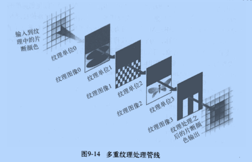

## 如何利用OpenGL给视频添加时间水印

@(opengl)

[TOC]

### 1. 效果图


### 2. 基本思想

> 多重纹理



### 3. 水印数据生成

`由于是在Android设备上实现，这里仅讨论Android实例`

```kotlin
fun start(waterConfig: WaterConfig = WaterConfig()) {
        if (subscription == null) {
            this.waterConfig = waterConfig.apply {
                subscription = Observable.interval(0L, 1L, TimeUnit.SECONDS).subscribe({
                    lock.lock()
                    try {
                        makeWaterMark(this)
                    } finally {
                        lock.unlock()
                    }

                }, {}, {})
            }
        }
    }


    private fun makeWaterMark(waterConfig: WaterConfig) {
        with(waterConfig) {
            //make watermark info
            timeStamp = System.currentTimeMillis()
            val timeText = CalendarUtil.getTimeStamp(timeStamp, "yyyy-MM-dd HH:mm:ss")
            val location = Store.getInstance().getState(SystemStatusState::class.java).location
            val locationText = if (location == null) "--,--" else String.format(Locale.getDefault(),
                    (if (location.longitude > 0) "E" else "W") + " %.4f," +
                            (if (location.getLatitude() > 0) "N" else "S") + " %.4f",
                    Math.abs(location.longitude),
                    Math.abs(location.getLatitude()))
            val speedText = if (location == null) "0.00km/h" else String.format(Locale.getDefault(), "%.2fkm/h", location.speed)

            locationRect.set(padding, padding + yOffSet, (padding + commonPaint.measureText(locationText)), textTopY + yOffSet)
            with(commonPaint.measureText(speedText)) {
                speedRect.set(width.toFloat() - this - padding, padding + yOffSet, speedTextRight, textTopY + yOffSet)
            }

            timeRect.set(padding, timeTextTop + yOffSet, padding + commonPaint.measureText(timeText), timeTextBottom + yOffSet)


            //Prepare canvas
            if (bitmap == null) {
                bitmap = Bitmap.createBitmap(width, height, Bitmap.Config.ARGB_8888)
                waterMarkBuffer = ByteBuffer.allocate(bitmap!!.byteCount)
                canvas.setBitmap(bitmap)
            }


            //clear canvas
            canvas.drawColor(Color.TRANSPARENT, PorterDuff.Mode.CLEAR)
            //start to draw

            canvas.drawText(timeText, padding, timeTextBottom, commonPaint)
            canvas.drawText(locationText, padding, textTopY, commonPaint)
            canvas.drawText(speedText, speedRect.left, textTopY, commonPaint)


            //copy pixels

            bitmap?.copyPixelsToBuffer(waterMarkBuffer)
            waterMarkBuffer?.position(0)
        }
    }
```

`P.S.:纹理数据1s刷新一次，CPU占用率可以不考虑`

### 4. 纹理创建

1. 创建二维纹理

```java
                //水印start
                case 1:
                    GLES20.glBindTexture(GLES20.GL_TEXTURE_2D, textures[i]);
                    GlUtil.checkGlError("glBindTexture " + textures[i]);
                    GLES20.glTexParameterf(GLES20.GL_TEXTURE_2D, GLES20.GL_TEXTURE_MIN_FILTER, GLES20.GL_LINEAR);
                    GLES20.glTexParameterf(GLES20.GL_TEXTURE_2D, GLES20.GL_TEXTURE_MAG_FILTER, GLES20.GL_LINEAR);
                    GLES20.glTexParameteri(GLES20.GL_TEXTURE_2D, GLES20.GL_TEXTURE_WRAP_S, GLES20.GL_CLAMP_TO_EDGE);
                    GLES20.glTexParameteri(GLES20.GL_TEXTURE_2D, GLES20.GL_TEXTURE_WRAP_T, GLES20.GL_CLAMP_TO_EDGE);
                    break;
                //水印end
```

2. 片元着色器定义

```
                    //水印start
                    "uniform sampler2D waterMark;\n" +
                    "uniform float tex_h;\n" +
                    "uniform float tex_w;\n" +
                    "uniform vec4  location;\n" +
                    "uniform vec4  speed;\n" +
                    "uniform vec4  time;\n" +
                    //水印end
```

`waterMark -- 水印纹理`

`tex_h -- 纹理高度`

`tex_w -- 纹理宽度`

`location -- 经纬度纹理坐标`

`speed -- 速度纹理坐标`

`time -- 时间纹理坐标`

3. 绘制

   将相关数据传入GL

   ```kotlin
           //水印start
           WaterMarkHelper.WaterMark temp = waterMarkHelper.peek();
           if(temp != null && !temp.equals(waterMark) ){
               waterMark = temp;
               GLES20.glBindTexture(GLES20.GL_TEXTURE_2D, textures[1]);
               GlUtil.checkGlError("glBindTexture " + textures[1]);
               GLES20.glTexImage2D(GLES20.GL_TEXTURE_2D,
                       0,
                       GLES20.GL_RGBA, width,
                       height, 0, GLES20.GL_RGBA,
                       GLES20.GL_UNSIGNED_BYTE,
                       waterMark.getWaterMark());
               GlUtil.checkGlError("glTexImage2D watermark");

               GLES20.glUniform1f(tex_h, (float) height);
               GlUtil.checkGlError("glUniform1f tex_h");
               GLES20.glUniform1f(tex_w, (float) width);
               GlUtil.checkGlError("glUniform1f tex_w");
               GLES20.glUniform4f(location, waterMark.getLocationRect().left, waterMark.getLocationRect().top, waterMark.getLocationRect().right, waterMark.getLocationRect().bottom);
               GlUtil.checkGlError("glUniform4f location");
               GLES20.glUniform4f(speed, waterMark.getSpeedRect().left, waterMark.getSpeedRect().top, waterMark.getSpeedRect().right, waterMark.getSpeedRect().bottom);
               GlUtil.checkGlError("glUniform4f speed");
               GLES20.glUniform4f(time, waterMark.getTimeRect().left, waterMark.getTimeRect().top, waterMark.getTimeRect().right, waterMark.getTimeRect().bottom);
               GlUtil.checkGlError("glUniform4f time");

               GLES20.glActiveTexture(GLES20.GL_TEXTURE1);
               GlUtil.checkGlError("glActiveTexture: GL_TEXTURE1");
               GLES20.glBindTexture(GLES20.GL_TEXTURE_2D, textures[1]);
               GlUtil.checkGlError("glBindTexture:" + textures[1]);
               GLES20.glUniform1i(waterMarkTextureHandle, 1);
               GlUtil.checkGlError("glUniform1i: waterMarkTextureHandle");
           }
           //水印end
   ```

   ​

4. 片元着色器混合逻辑

   `由于纹理数据生成时偷懒，画了一张和视频大小一模一样的纹理图，在混合时利用的GLSL提供的mix方法，这个在混合时会根据混合因子进行混合，这会导致画面偏暗，所以仅在我们实际想添加水印的位置进行混合`

   ```
                       "void main() {\n" +
                       //水印start
                       "    float pixelx = vTextureCoord.x;\n" +
                       "    float pixely = vTextureCoord.y;\n" +
                       "    float xcoord = pixelx * tex_w;\n" +
                       "    float ycoord = pixely * tex_h;\n" +
                       "    if((xcoord >= location.r && ycoord >= location.g && xcoord <= location.b && ycoord <= location.a)" +
                       "       || (xcoord >= speed.r && ycoord >= speed.g && xcoord <= speed.b && ycoord <= speed.a)" +
                       "       || (xcoord >= time.r && ycoord >= time.g && xcoord <= time.b && ycoord <= time.a)" +
                       "    ){\n" +
                       "       vec4 temp = texture2D(waterMark,vTextureCoord);\n" +
                       "       vec4 water = vec4(temp.rgb,temp.a);\n" +
                       "       gl_FragColor = mix(texture2D(sTexture, vTextureCoord),temp,.4);\n" +

                       "    }else{\n" +
                       //水印end
                       "       gl_FragColor = texture2D(sTexture, vTextureCoord);\n" +
                       "    }\n" +
                       "}\n";
   ```

   `P.S.:就一点需要注意，从bitmap获取的数据颜色格式是ARGB,但是在传递数据时的颜色格式是RGBA，混合前需要改下顺序`

### 5. 优化建议

纹理每次动态生成，其优点在于可以动态改变纹理的字体相关属性，缺点是占CPU。

若纹理内容相对简略，比如只有英文和数字，可以仅设置一张纹理大图，通过在该纹理的位移来进行目标纹理拼凑。

