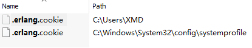

## RabbitMQ安装

@(RabbitMQ)

[TOC]

### 1. 下载安装Erlang

[下载地址](http://www.erlang.org/downloads)

> 注意：安装后会生成两个.erlang.cookie文件，请务必保证其中内容一致
>
> 否则会提示`rabbitmq Authentication failed`

### 2. 下载安装RabbitMQ

[下载地址](http://www.rabbitmq.com)

