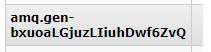

## RabbitMQ入门

@(RabbitMQ)

[TOC]

### 1. 管理页面

`host:15672（默认）`

`默认用户名：guest 密码：guest --- 此账号仅服务器本机可访问`

### 2. 基础概念

[官方文档v3.5.7](http://previous.rabbitmq.com/v3_5_7/amqp-0-9-1-reference.html)

#### 2.1 Connections

> The connection class provides methods for a client to establish a network connection to a server, and for both peers to operate the connection thereafter.

#### 2.2 Channel

> The channel class provides methods for a client to establish a channel to a server and for both peers to operate the channel thereafter.

#### 2.3 Exchange

> Work with exchanges.
>
> Exchanges match and distribute messages across queues. Exchanges can be configured in the server or declared at runtime.

`exchange命名规则:`

- Exchange names starting with "amq." are reserved for pre-declared and standardised exchanges. The client MAY declare an exchange starting with "amq." if the passive option is set, or the exchange already exists. Error code: [access-refused](http://previous.rabbitmq.com/v3_5_7/amqp-0-9-1-reference.html#constant.access-refused)
- The exchange name consists of a non-empty sequence of these characters: letters, digits, hyphen, underscore, period, or colon. Error code: [precondition-failed](http://previous.rabbitmq.com/v3_5_7/amqp-0-9-1-reference.html#constant.precondition-failed)

`exchange创建参数`

- **durable**

  If set when creating a new exchange, the exchange will be marked as durable. Durable exchanges remain active when a server restarts. Non-durable exchanges (transient exchanges) are purged if/when a server restarts.

  - The server MUST support both durable and transient exchanges.

- **auto-delete**

  If set, the exchange is deleted when all queues have finished using it.

  - The server SHOULD allow for a reasonable delay between the point when it determines that an exchange is not being used (or no longer used), and the point when it deletes the exchange. At the least it must allow a client to create an exchange and then bind a queue to it, with a small but non-zero delay between these two actions.
  - The server MUST ignore the auto-delete field if the exchange already exists.

- **internal**

  If set, the exchange may not be used directly by publishers, but only when bound to other exchanges. Internal exchanges are used to construct wiring that is not visible to applications.

#### 2.4 Queue

> Queues store and forward messages. Queues can be configured in the server or created at runtime. Queues must be attached to at least one exchange in order to receive messages from publishers.

`queue创建注意事项:`

- The server MUST create a default binding for a newly-declared queue to the default exchange, which is an exchange of type 'direct' and use the queue name as the routing key.
- The server SHOULD support a minimum of 256 queues per virtual host and ideally, impose no limit except as defined by available resources.

`queue命名规则:`

- The queue name MAY be empty, in which case the server MUST create a new queue with a unique generated name and return this to the client in the Declare-Ok method.

- Queue names starting with "amq." are reserved for pre-declared and standardised queues. The client MAY declare a queue starting with "amq." if the passive option is set, or the queue already exists. Error code: [access-refused](http://previous.rabbitmq.com/v3_5_7/amqp-0-9-1-reference.html#constant.access-refused)

- The queue name can be empty, or a sequence of these characters: letters, digits, hyphen, underscore, period, or colon. Error code: [precondition-failed](http://previous.rabbitmq.com/v3_5_7/amqp-0-9-1-reference.html#constant.precondition-failed)

  如果队列名为空，会自动生成队列名(`?由于用的SpringBoot，不清楚这个是SpringBoot做的还是RabbitMQ做的`)

  

  ​

`queue创建参数`

- **durable**

  If set when creating a new queue, the queue will be marked as durable. Durable queues remain active when a server restarts. Non-durable queues (transient queues) are purged if/when a server restarts. Note that durable queues do not necessarily hold persistent messages, although it does not make sense to send persistent messages to a transient queue.

  - The server MUST recreate the durable queue after a restart.
  - The server MUST support both durable and transient queues.

- **exclusive**

  Exclusive queues may only be accessed by the current connection, and are deleted when that connection closes. Passive declaration of an exclusive queue by other connections are not allowed.

  - The server MUST support both exclusive (private) and non-exclusive (shared) queues.
  - The client MAY NOT attempt to use a queue that was declared as exclusive by another still-open connection. Error code: [resource-locked](http://previous.rabbitmq.com/v3_5_7/amqp-0-9-1-reference.html#constant.resource-locked)

- **auto-delete**

  If set, the queue is deleted when all consumers have finished using it. The last consumer can be cancelled either explicitly or because its channel is closed. If there was no consumer ever on the queue, it won't be deleted. Applications can explicitly delete auto-delete queues using the Delete method as normal.

  - The server MUST ignore the auto-delete field if the queue already exists.

  ​