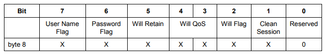
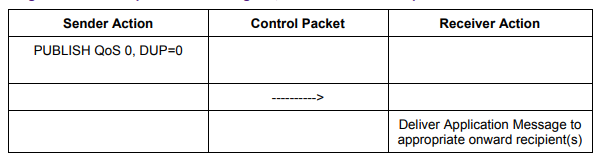
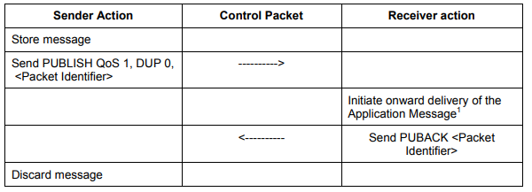
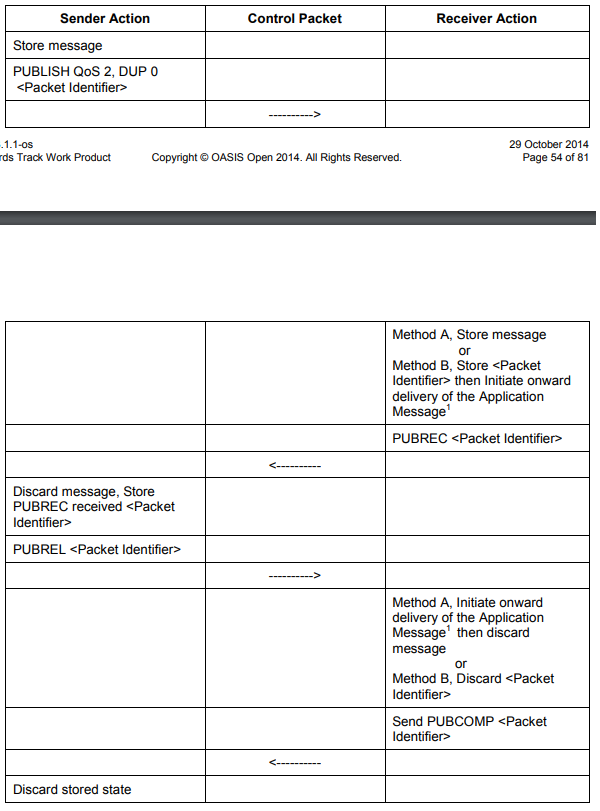

## RabbitMQ与Mqtt

@(rabbitmq,mqtt)

[TOC]

### 1. 开启插件

```C
%RabbitMqRootDir%\sbin\rabbitmq-plugins.bat enable rabbitmq_mqtt
```

### 2. Mqtt协议

[协议文档v3.1.1](http://docs.oasis-open.org/mqtt/mqtt/v3.1.1/os/mqtt-v3.1.1-os.pdf)

这里仅讨论我关心的内容

#### 2.1 Connect Flags




##### 2.1.1 Clean Session

* `0`    ---   当客户端连接时，服务端需要恢复上一个Session状态，若不存在，则新建；当客户端断开，服务端要保存当前Session状态以保证下次连接时恢复。
* `1`   ---   服务端不用存储客户端连接状态，每次连接都新建Session，客户端断开则清除Session。

以下为具体需要保存的Session状态

客户端Session状态

* 已发送给服务器但未收到ACK的QoS 1和QoS 2消息
* 从服务器已收到但尚未发送ACK的QoS 2消息

服务端Session状态

* Session是否存在
* 客户端的订阅信息
* 已发送给客户端但未收到ACK的QoS 1和QoS 2 消息
* 待发送的QoS 1和QoS 2消息
* 从客户端收到但尚未发送ACK的QoS 2消息
* 待发送的QoS 0消息（可选）

`Retained消息不属于Session状态，但是服务器需要保存该类消息直到Session结束`

##### 2.2.2 Will

连接时设置的Will消息，服务器先暂存，将在满足以下条件时触发发送动作：

* An I/O error or network failure detected by the Server.
* The Client fails to communicate within the Keep Alive time.
* The Client closes the Network Connection `without first sending a DISCONNECT Packet`.
* The Server closes the Network Connection because of a protocol error.

#### 2.2 QoS

##### 2.2.1 Qos 0




> 1. 最多发一次
> 2. 不保证服务器一定能收到
> 3. 不需要接收接收端的响应信息
> 4. 不会重试

`也就是说，这个消息只管发送，但是不保证对方一定能收到`

##### 2.2.2 QoS 1




>1. 最少发一次
>2. 保证消息至少成功发送给接收者一次
>3. 发送者需要收到接收者的PUBACk packet才认为发送成功

`存在消息重复发送的风险`

##### 2.2.3 QoS 2



> 1. 最高的质量服务，保证消息不会丢失或重复，真·发送一次
> 2. 发送过程需要更多的ACK确认信息

`消息发送效率严重降低`

#### 2.3 Topic通配符规则

> `/` ---  Topic level分隔符
>
> `#` --- 多level任意匹配
>
> `sport/tennis/player1/#`匹配:
>
> * sport/tennis/player1
> * sport/tennis/player1/ranking
> * sport/tennis/player1/score/wimbledon
>
> 注意：
>
> * `sport/#` 匹配 sport
> * `#`匹配所有消息
> * `sport/tennis#` 无效规则！！！
> * `sport/tennis/#/ranking` 无效规则！！！
>
> `+` --- 单level任意匹配
>
> `sport/tennis/+`
>
> * 匹配：sport/tennis/player1 和 sport/tennis/player2 
> * 不匹配 sport/tennis/player1/rankking
>
> `sport/+`
>
> * 匹配：sport/   
> * 不匹配  sport
>
> 注意：
>
> * `+`  有效规则
> * `+/tennis/#`  有效规则
> * `sport+` 无效规则
> * `sport/+/player1` 有效规则
> * /finance 匹配  `+/+` 和 `/+`，不匹配 `+` 
>
> `$`  --- 放在首位，用于特殊区分
>
> * `$SYS/`  服务端定义的消息协议，用户端不能使用
> * `#` 不会匹配 以`$`开头的topic
> * `+/#`不会匹配以`$`开头的topic  

### 3. RabbitMQ对Mqtt的协议适配

| Mqtt         | RabbitMQ(AMQP) |
| ------------ | -------------- |
| CleanSession | auto-delete    |
| FALSE        | FALSE          |
| TRUE         | TRUE           |

### 4. RabbitMQ对Mqtt QoS的适配

> **RabbitMQ does not support QoS2 subscriptions**. RabbitMQ automatically downgrades QoS 2 publishes and subscribes to QoS 1. Messages published as QoS 2 will be sent to subscribers as QoS 1. Subscriptions with QoS 2 will be downgraded to QoS1 during SUBSCRIBE request (SUBACK responses will contain the actually provided QoS level). 

### 5. mqtt与amqp消息互通

> RabbitMQ对于mqtt的数据传输是通过`amq.topic`exchange来进行交换的
>
> 以下例子均为本地默认端口

#### 5.1 mqtt发送|amqp接收 

* 发送:   topic可以是mqtt格式，也可以是amqp格式

  ```python
  import paho.mqtt.client as mqtt
  
  client = mqtt.Client("hello_mqtt_client")
  client.username_pw_set("guest", "guest")
  client.connect("localhost", 1883, 60)
  client.publish("hello/mqtt", "hello mqtt", qos=0, retain=False)
  ```

  

* 接收：

  1. 队列创建随意
  2. 将1创建的队列绑定到`amq.topic`exchange, `routingKey`为能接收到发送的topic即可，按照amqp规则配置

  ```kotlin
      @Bean
      @Primary
      open fun connectionFactory2() = CachingConnectionFactory().apply {
          setAddresses("127.0.0.1:5672")
          username = "guest"
          setPassword("guest")
          virtualHost = "/"
          isPublisherConfirms = true
      }    
  
      @Bean
      open fun topic() = TopicExchange("amq.topic")
      
      @Bean
      open fun queue() = Queue("lalalala")
  
      @Bean
      open fun bindQueue() = BindingBuilder.bind(queue()).to(topic()).with("hello.mqtt")!!
  ```

  ```kotlin
      @RabbitListener(queues = ["lalalala"])
      fun processMessage2(buffer: ByteArray) {
          println("接收到来自lalalala队列的消息:\n ${buffer.toString(Charset.defaultCharset())}")
      }
  ```

#### 5.2 amqp发送|mqtt接收

* 发送：

  1. topic按照amqp格式
  2. exchange指定为`amq.topic`

  ```javascript
        const amqp = require('amqplib/callback_api')
        amqp.connect(
            {
              hostname: 'localhost',
              port: '5672',
              username: 'guest',
              password: 'guest'  
            }, (err, conn) => {
          if (err !== null) {
            reject(err)
          } else {
            connection.conn = conn
            conn.createChannel(function (err, ch) {
              if (err !== null) {
                reject(err)
              } else {
                connection.ch = ch
              }
            })
          }
        })
  ```

  ```javascript
  connection.ch.publish('amq.topic', 'hello.amqp', Buffer.from('hello amqp'))
  ```

  

* 接收：订阅相关topic，既可以是mqtt格式，也可以是amqp格式

  `以下例子用的ws，需要开启相关端口`

  ```javascript
  let client
  function connect {
      client = new Paho.MQTT.Client('localhost', Number(15675), "/ws", "hello.amqp.client/")
      client.userName = 'guest'
      client.password = 'guest'
      client.onMessageArrived = onMessageArrived
      client.connect({onSuccess: onConnect})
  }
  
  function onConnect () {
      client.subscribe('hello.amqp')
  }
  
  function onMessageArrived (msg) {
       console.log("onMessageArrived:" + msg.payloadString)
  }
  ```

  