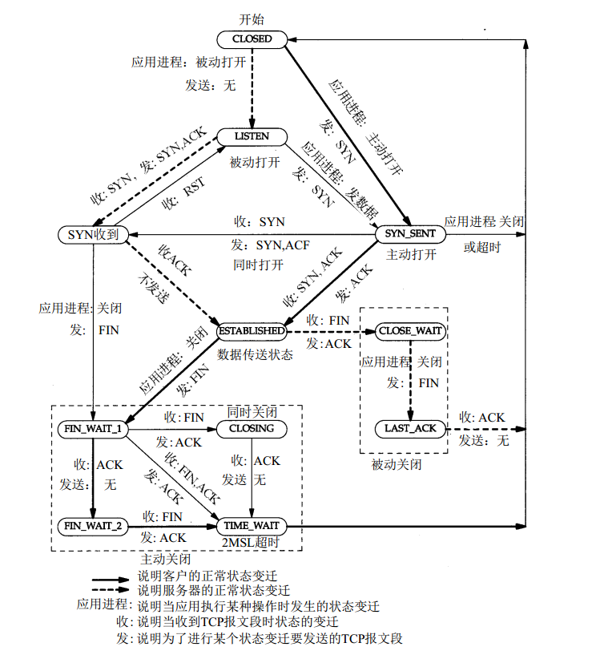
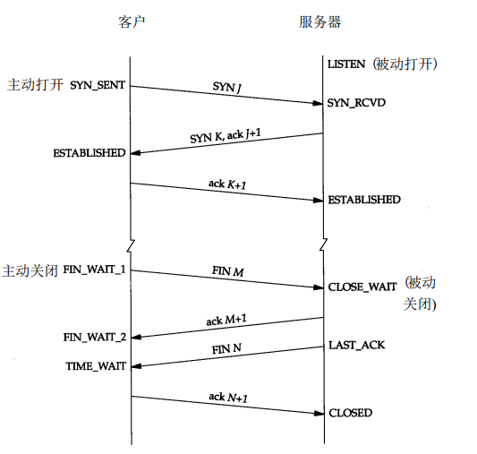

### TCP生命周期

#### 1. TCP首部标志位

> 置1表示有效

| 标志位 | 全称            | 简介     |
| ------ | --------------- | -------- |
| URG    | Urgent          | 紧急指针 |
| ACK    | Acknowledgement | 确认信息 |
| PSH    | PUSH            | 发送消息 |
| RST    | RESET           | 重置连接 |
| SYN    | Synchronization | 发起连接 |
| FIN    | FINISH          | 结束发送 |

#### 2. TCP生命周期

> 显然，这个生命周期是根据协议衍生出来的相关状态

##### 2.1 状态

|          | Client      | Server      |
| -------- | ----------- | ----------- |
|          | CLOSED      |             |
|          |             | LISTEN      |
| 建立链接 | SYN_SENT    |             |
|          |             | SYN_RCVD    |
|          | ESTABLISHED |             |
|          |             | ESTABLISHED |
| 断开链接 | FIN_WAIT_1  |             |
|          |             | CLOSE_WAIT  |
|          | FIN_WAIT_2  |             |
|          |             | LAST_ACK    |
|          | TIME_WAIT   |             |
|          |             | CLOSED      |

##### 2.2 状态迁移图

##### 2.3 连接建立三次握手与连接断开四次握手

> 1. 主动发起断开方需要处于TIME_WAIT状态当收到对方的FIN消息后或者等待2倍MSL时间才退出，期间对应端口将被占用，这个特性表明主动断开一般由客户端发起，否则服务器将出现大量端口无法被使用状态。
> 2. FIN只是断开发送通路，若对方没有发送FIN，那么还可以收到对方的发送的消息，此为半关闭。

